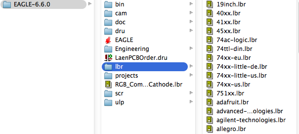

Eagle Collecting
================

Gotta catch all the components.

In this section we'll go over adding libraries to Eagle
from Github.

---

## quick checklist

There are three things you will need to add before starting.

* [ ] adafruit and sparkfun libraries
* [ ] sparkfun dru
* [ ] sparkfun cam

## Grab More Parts

Because more parts make your Eagle more awesome.

Before we begin, find out where you installed Eagle and open the "lib" folder.

 </img>

#### Adafruit

**First go to the following site and click on "Download as Zip":**

https://github.com/adafruit/Adafruit-Eagle-Library

Afterwards open the Eagle folder and place the `.lbr` file from the 
Adafruit zip folder into your Eagle Folder's `lbr` directory.
(you'll know it's the one if there are lots of existing `.lbr` files there)

===

#### Sparkfun

**Second go to the following site and click on "Download as Zip":**
https://github.com/sparkfun/SparkFun-Eagle-Libraries

Sparkfun keeps their files as separate `.lbr` files, after extracting, again place
all of the Sparkfun lbr's into your Eagle's `lbr` folder.

## How to Engage

1. Restart Eagle
2. Right click on "Library" in the Eagle control panel, and select (Use All)

## Build!

Go ahead and download the Flashlight PCB design from our website and add your tweaks here and there.

<!-- TODO CREATE FLASHLIGHT PCB TEMPLATE -->

Add your name to the project in silkscreen, and modify the shape of the board as well.

## Caveats

Eagle is great for a first electronics design tool, however the free version does have it's limits.

The main two limitations of Eagle Light are:

* two layers max
* max board size is 100x80mm

Lastly, Eagle Light is only free so long as not used for commercial purposes, and has $70 commercial license.

In order to get around these limitations, you may purchase a pricey-high-grade license (or a reasonablely priced student license), or you can transfer your skills to free-and-open-source-software  -- like Kicad -- which we will cover in the upper division course.

Kicad is a professional grade electronics cad which while a little more advanced, offers at the time of this writing up to 12 technical layers, as opposed to the Eagle Light's 2 layers.

